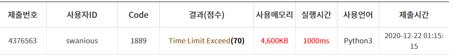

## NQueen 문제

- 정석적인 풀이(시간초과...)

  모든 후보군을 재귀를 통해 둘러보며 후보를 찾는다.

  1. 같은 행(or 열)에는 Queen을 놓을 수 없음(remove)
  2. 대각선에는 Queen을 놓을 수 없음(remove)

  이후, 후보군이 쌓이면 (`len(arr) == n`),

  Queen을 배치할 수 있다는 의미이므로, ans를 1상승시키고 다음 dfs를 도는 풀이법

  하지만, 이렇게 풀었을 경우 시간초과가 났다 ㅠㅠ..

```python
def dfs(arr, n):
    global ans

    if len(arr) == n:  # 정답 배열(arr)의 길이가 n과 같아지면 ans를 1올리고 return
        ans += 1
        return 0

    candidate = list(range(n)) # 0부터 n-1까지 후보 배열을 만든다.
    for i in range(len(arr)):
        if arr[i] in candidate:
            candidate.remove(arr[i])

        distance = len(arr) - i
        if arr[i] + distance in candidate:  # 같은 대각선 상에 있으면 후보 삭제
            candidate.remove(arr[i] + distance)
        if arr[i] - distance in candidate:  # 같은 대각선 상에 있으면 후보 삭제
            candidate.remove(arr[i] - distance)

    if candidate != []:
        for i in candidate:
            arr.append(i)  # 후보의 요소를 정답 배열의 다음 요소로 추가
            dfs(arr, n)  # 재귀
            arr.pop()

    else:
        return 0
ans = 0
n = int(input())
for i in range(n):
    dfs([i], n);
print(ans)

```

